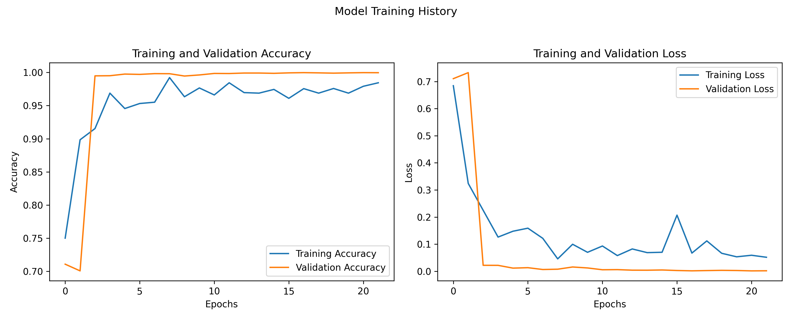
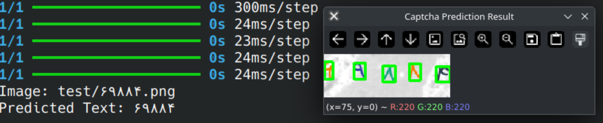

# Persian Digit Captcha Recognition Model

A deep learning model to recognize Persian digits in CAPTCHA images.

## Getting Started

```bash
# Install dependencies
pip install -r requirements.txt

# Generate Dataset
python datatset

# Train Model
python train.py

# Run prediction on test images
python predict.py
```

## Model Summary

The model is a Convolutional Neural Network (CNN) with the following architecture:

| Layer (type)              | Output Shape       | Param #   |
|---------------------------|--------------------|-----------|
| input_layer (InputLayer)  | (None, 40, 30, 1) | 0         |
| cast (Cast)               | (None, 40, 30, 1) | 0         |
| conv2d (Conv2D)           | (None, 40, 30, 32)| 320       |
| batch_normalization       | (None, 40, 30, 32)| 128       |
| max_pooling2d (MaxPooling2D)| (None, 20, 15, 32)| 0        |
| flatten (Flatten)         | (None, 9600)      | 0         |
| dense (Dense)             | (None, 64)        | 614,464   |
| dropout (Dropout)         | (None, 64)        | 0         |
| cast_1 (Cast)             | (None, 64)        | 0         |
| dense_1 (Dense)           | (None, 10)        | 650       |

**Total Parameters:** 615,562 (2.35 MB)

- **Input Shape:** (40, 30, 1)
- **Output Classes:** 10 (digits 0-9)
- **Optimizer:** Adam
- **Loss Function:** Categorical Crossentropy

## Training History



- Dataset: 100,000 Persian digit images
- Training accuracy: ~99%
- Validation accuracy: ~98%
- Early stopping at epoch 21

## Sample Results


## Additional Resources

For more details about this project, you can read my comprehensive blog post in Persian [here](https://www.rahro14.ir/?p=6357).